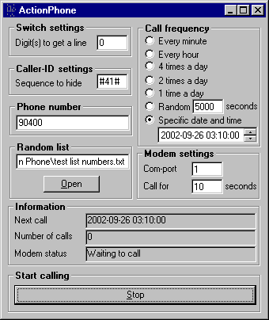



## ActionPhone

### Description

Use your modem to annoy your friends! This little app will use your modem and call your friends in different intervalls. You can also use a list of several numbers it can randomize from. Use only on friends and have fun! Added new feature!
 
### More Info
 
You need a modem.

Someone might not like beeing called all the time. I use it on a friend that persists on calling me every time he's out late.

             |
---                |---
**Submitted On**   |2002-09-24 17:47:56
**By**             |[Martin Idman](https://github.com/Planet-Source-Code/PSCIndex/blob/master/ByAuthor/martin-idman.md)
**Level**          |Intermediate
**User Rating**    |5.0 (30 globes from 6 users)
**Compatibility**  |VB 6\.0
**Category**       |[Jokes/ Humor](https://github.com/Planet-Source-Code/PSCIndex/blob/master/ByCategory/jokes-humor__1-40.md)
**World**          |[Visual Basic](https://github.com/Planet-Source-Code/PSCIndex/blob/master/ByWorld/visual-basic.md)
**Archive File**   |[ActionPhon1400031032002\.zip](https://github.com/Planet-Source-Code/martin-idman-actionphone__1-39259/archive/master.zip)

### API Declarations

GetTickCount

